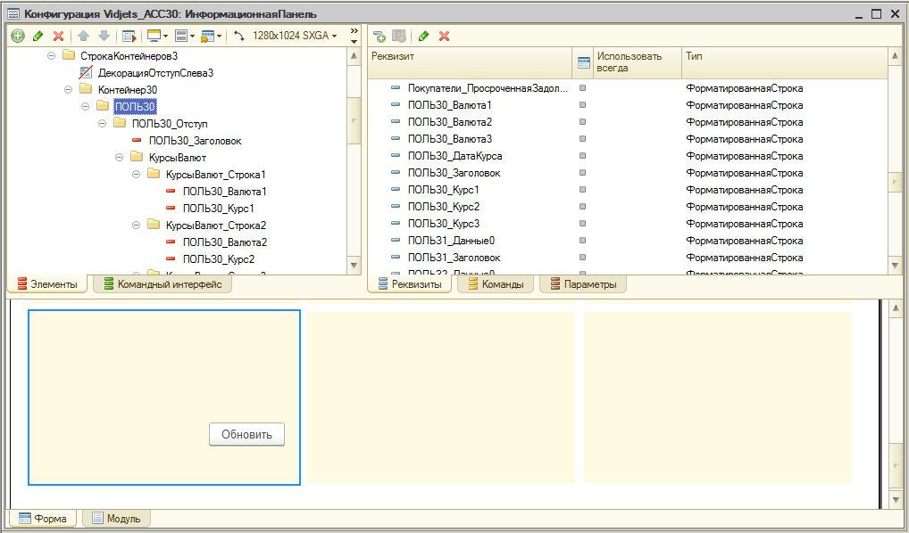

# Расширение информационной панели 1С Бухгалтерия предприятия 3.0

__Что это:__

расширение конфигурации "1С Бухгалтерия предприятия" редакции 3.0, которое содержит шаблоны пользовательских блоков для информационной панели. _Мне больше нравиться называть это "виджеты"._

С помощью этого расширения вы можете сделать от одного до трех собственных виджетов.

__Как это выглядит:__

На скриншоте первый виджет стандартный а второй и третий пользовательские

На скриншоте форма настройки информационной панели


## Встраивание расширения в конфигурацию
Подключение расширения к конфигурации многократно описано на просторах Интернета, поэтому здесь этому внимание не будет уделено. Дальнейшее описание будет касаться только пользовательских виджетов и поэтому слово "пользовательские" в нем использоваться не будет. В расширении три шаблона виджетов с номерами 0, 1 и 2. Номера виджетов используются в наименовании методов, которые описаны ниже. В описании номер метода заменен на символ "Х".

### Отключение виджета
Любой виджет можно отключить, после чего он становиться недоступен в "Настройке информационной панели" и не отображается на самой информационной панели. Воспользуйтесь методом:  
`ПОЛЬЗX_Доступен()`

Расположение: _РасширениеКонфигурации - общий модуль БлокиИнформационнойПанели_
Установите возвращаемое значение метода в `Истина` если виджет доступен или `Ложь` если недоступен.

### Наименование виджета
Наименование виджета в "Настройке информационной панели" определяется методом:  
`ТекстЗаголовкаПОЛЬЗX()`

Расположение: _РасширениеКонфигурации - общий модуль БлокиИнформационнойПанелиКлиентСервер_ Наименование виджета обычно, но не обязательно используется как значение заголовка блока.

### Способ обновления данных
Расширение к стандартному способу обновления данных виджетов добавляет альтернативный способ обновления данных.

__Стандартный способ.__ Обновление данных срабатывает при:
* запуске конфигурации
* смене организации на информационной панели
* нажатие на кнопку информационной панели "_Обновить_"
* по прошествию суток после последнего обновления, если конфигурация не выгружалась

__Альтернативный способ.__ К событиям стандартного способа добавляется:
* по тайм-ауту с помощью обработчика ожидания

В расширении тайм-аут установлен равным 15 минутам. Значение можно изменить, установив переменную модуля:
`м_чИнтервалОбновления = 900;`

Расположение: _РасширениеКонфигурации - модуль формы ИнформационнаяПанель_

Переключение между способами обновления данных выполняется с помощью переменной модуля:
`м_бАльтернативныйСпособОбновления = Ложь;`

Расположение: _РасширениеКонфигурации - модуль формы ИнформационнаяПанель_ Если значение `Истина` то работает альтернативный способ обновления, если `Ложь` то работает стандартный способ.

### Информация виджета
Для того, чтобы отобразить на виджете необходимую информацию требуется выполнить следующую последовательность действий:
1. Разместить на форме _РасширениеКонфигурации - форма ИнформационнаяПанель_ реквизиты, которые будут программно заполнены данными. Тип реквизита: `ФорматированнаяСтрока` 
2. Расставить реквизиты и иные элементы формы в блоке виджета. 
3. Если виджет имеет элементы управления, разместите команды формы и обработчик команды.
4. Установите наименование виджета `ТекстЗаголовкаПОЛЬЗХ()` _РасширениеКонфигурации - общий модуль БлокиИнформационнойПанелиКлиентСервер_
5. Включите доступность виджета с помощью метода `ПОЛЬЗХ_Доступен()` _РасширениеКонфигурации - общий модуль БлокиИнформационнойПанели_
6. Опишите свойства вашего виджета `СвойстваПОЛЬЗX()` _РасширениеКонфигурации - общий модуль БлокиИнформационнойПанели_. Свойства виджета в этом методе должны соответствовать реквизитам формы из п.п. 1. Метод должен возвращать строку. Пример:  
``` bsl
Функция СвойстваПОЛЬЗ0()
	Перем сСвойства;
	
	сСвойства = "ПОЛЬЗ0_Заголовок, ПОЛЬЗ0_ДатаКурса,
	| ПОЛЬЗ0_Валюта1, ПОЛЬЗ0_Валюта2, ПОЛЬЗ0_Валюта3,
	| ПОЛЬЗ0_Курс1, ПОЛЬЗ0_Курс2, ПОЛЬЗ0_Курс3,";
	
	Возврат сСвойства;
КонецФункции
```
7. Реализуйте метод `ПОЛЬЗХ(Параметры)` для заполнения свойств виджета данными _РасширениеКонфигурации - общий модуль БлокиИнформационнойПанели_. Данные нужно "упаковать" в структуру, где ключ структуры это имя свойства виджета, которое определено на шаге 6 этого алгоритма. Значение структуры это данные с типом `Форматированная строка`. Структуру с данными необходимо поместить во временное хранилище. Пример реализации:
```bsl
Процедура ПОЛЬЗ2(Параметры) Экспорт	
	Перем Шрифт, ЦветТекста, стДанныеБлока, фсДанные, фсЗаголовок;
	
	Если Параметры.Инициализация Тогда
		Возврат;
	КонецЕсли;
	
	Шрифт = ШрифтыСтиля.ШрифтТекстаИнформационнойПанели;
	ЦветТекста = ЦветаСтиля.ЦветТекстаИнформационнойПанели;
	
	стДанныеБлока = Новый Структура();
	фсЗаголовок = ЗаголовокБлока(БлокиИнформационнойПанелиКлиентСервер.ТекстЗаголовкаПОЛЬЗ1());
	стДанныеБлока.Вставить("ПОЛЬЗ2_Заголовок", фсЗаголовок);
	фсДанные = Новый ФорматированнаяСтрока("Информация виджета пользователя", Шрифт, ЦветТекста);
	стДанныеБлока.Вставить("ПОЛЬЗ2_Данные", фсДанные);
	
	ПоместитьВоВременноеХранилище(стДанныеБлока, Параметры.АдресХранилища);
	
КонецПроцедуры
```
В метод передаются следующие параметры:

| Параметр | Комментарий |
|:---------------------- |:---------- |
| АдресХранилища | Строка - адрес хранилища результата |
| Организация | СправочникСсылка.Организации - организация, которая установлена в отборе информационной панели |
| ВариантОкругления | Число - 1 - округлять до целых рублей, 1000 - до тысяч | 
| ПоказыватьСравнениеСПрошлымГодом | Булево - необходимость сравнения с показателями прошлого года |
| Инициализация | Истина - заполнить только статическими данными |


Ссылка этого проекта на [Инфостарт](https://infostart.ru/public/790959/) Комментарии и звездочки из кулл.
